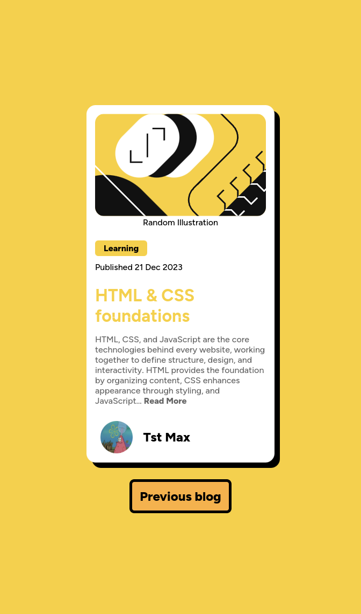
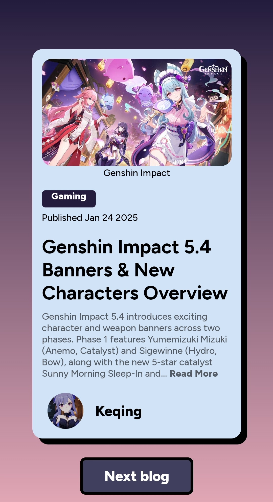

# Frontend Mentor - Custom Blog Preview Card solution

This is a custom solution to the [Blog Preview Card challenge on Frontend Mentor](https://www.frontendmentor.io/challenges/blog-preview-card-ckPaj01IcS). Frontend Mentor challenges are helpful for beginners, intermediate or even advanced FE devs to learn more about frontend technologies and gain experience. This is my custom solution to one of fem challenges. I have added some more functionalites and designs to make look better. If you find my project cool then you can drop a rating or suggest improvements on fem site.

## Table of contents

- [Overview](#overview)
  - [Screenshot](#screenshot)
  - [Links](#links)
- [My process](#my-process)
  - [Built with](#built-with)
  - [What I learned](#what-i-learned)
- [Continued development](#continued-development)
- [Author](#author)

## Overview

### Screenshot

  - Desktop

  - Mobile

### Links

- Github URL: [Blog Preview Card](https://github.com/Tasin269/frontendmentor/tree/master/blog-preview-card-main)
- Live Site URL: [Blog Preview Card](https://tasin269.github.io/frontendmentor/blog-preview-card-main/)

## My process

### Built with

- Semantic HTML5 markup
- CSS custom properties
- Flexbox
- CSS Grid
- Mobile-first workflow
- SCSS - Css preprocessor
- Jquery - Js library
- DotDotDot plugin(Jquery)

### What I learned

- If border color is not specified after setting a border then it will inherit from font color.
- **transform-style** is a cool property which can be used to preserve the 3d space(Y-axis) when rotating elements by setting it's value to **preserve-3d**. It can be used to make flipping or any other 3d based animations.
- **backface-visibility** is another useful property which can be used to hide the backside of an element by setting this property value to **hidden**.
- I used a Jquery plugin first time and it was a game changer. I need to know more about these plugins. Cool stuff😋.

### Continued development

I still need to learn more about css fundamentals and animation stuff.

## Author

- [All my fem challenges sites](https://tasin269.github.io/frontendmentor/)
- Frontend Mentor - [@Tasin269](https://www.frontendmentor.io/profile/Tasin269)
