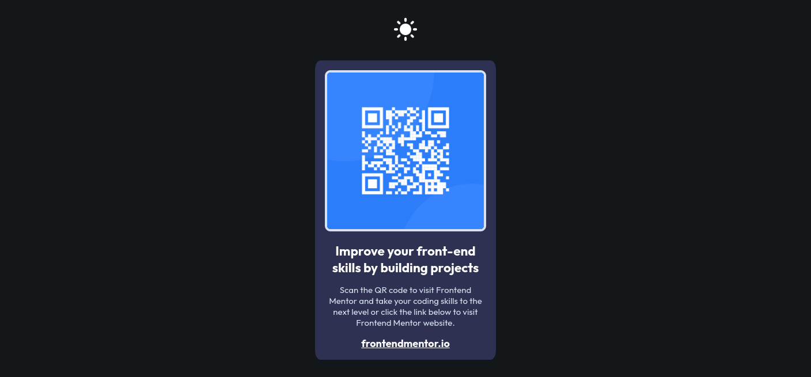

# Frontend Mentor - Custom QR code component solution

This is a custom solution to the [QR code component challenge on Frontend Mentor](https://www.frontendmentor.io/challenges/qr-code-component-iux_sIO_H). Frontend Mentor challenges are helpful for beginners, intermediate or even advanced FE devs to learn more about frontend technologies and gain experience. This is my custom solution to one of fem challenges. I have added some more functionalites and designs to make look better. If you find my project cool then you can drop a rating or suggest improvements on fem site.

## Table of contents

- [Overview](#overview)
  - [Screenshot](#screenshot)
  - [Links](#links)
- [My process](#my-process)
  - [Built with](#built-with)
  - [What I learned](#what-i-learned)
- [Continued development](#continued-development)
- [Author](#author)

## Overview

### Screenshot

  - Desktop



  - Mobile


### Links

- Github URL: [Qr Code Component](https://github.com/Tasin269/frontendmentor/tree/master/qr-code-component-main)
- Live Site URL: [Qr Code Component](https://tasin269.github.io/frontendmentor/qr-code-component-main/)

## My process

### Built with

- Semantic HTML5 markup
- CSS custom properties
- Flexbox
- CSS Grid
- Mobile-first workflow
- SCSS - Css preprocessor
- Jquery - Js library

### What I learned

- Semantic tags(header, main, button, etc) are better than non-semantic tags(div, span) for accessibility reasons.
- **Aria attributes** can be used with semantic tags to convey more meaning
```html
<button aria-label="Toggle theme button." id="theme-toggler">
```
- Alt attribute should be used to describe meaningful pictures. If it's design related or something then it should be left empty.
```html


```
- A webpage shouldn't have more than one h1 tag. We can start using header tags using any of header element but the hierarchy needs to maintained. Example: we can use h2 > h3 > h4 but we can't use h1 > h2 > h4.
- Anchor tags shouldn't be used inside button elements. Use anchor tags directly.
- Images can used inside button elements for specific perposes but aria attributes needs to be used to describe that button action.
- Special **[data-*] attributes** can be used in html tags to store extra information in tags. We later can retrive those information to use with css and js.
- When working with scss/sass or other preprocessors, it's better to use built-in css variables instead of that preprocessors variables so we can change them using js. Only use preprocessor variables where css variables don't work. For example when setting media query rules (min-width: $minWidth).
- **media query (prefers-color-scheme)** shouldn't be used in css to apply different styles for different themes. It should be used in js with **(matchMedia)** method to detect system theme settings and apply styles according to that.
- Custom properties can be used in css for animation stuff. For example with linear-gradient() function in css.
- Vendor prefixes (eg. -webkit-, -moz-) needs to used in css for older browsers support.

### Continued development

I still need to learn more about css fundamentals and animation stuff.

## Author

- [All my fem challenges sites](https://tasin269.github.io/frontendmentor/)
- Frontend Mentor - [@Tasin269](https://www.frontendmentor.io/profile/Tasin269)
