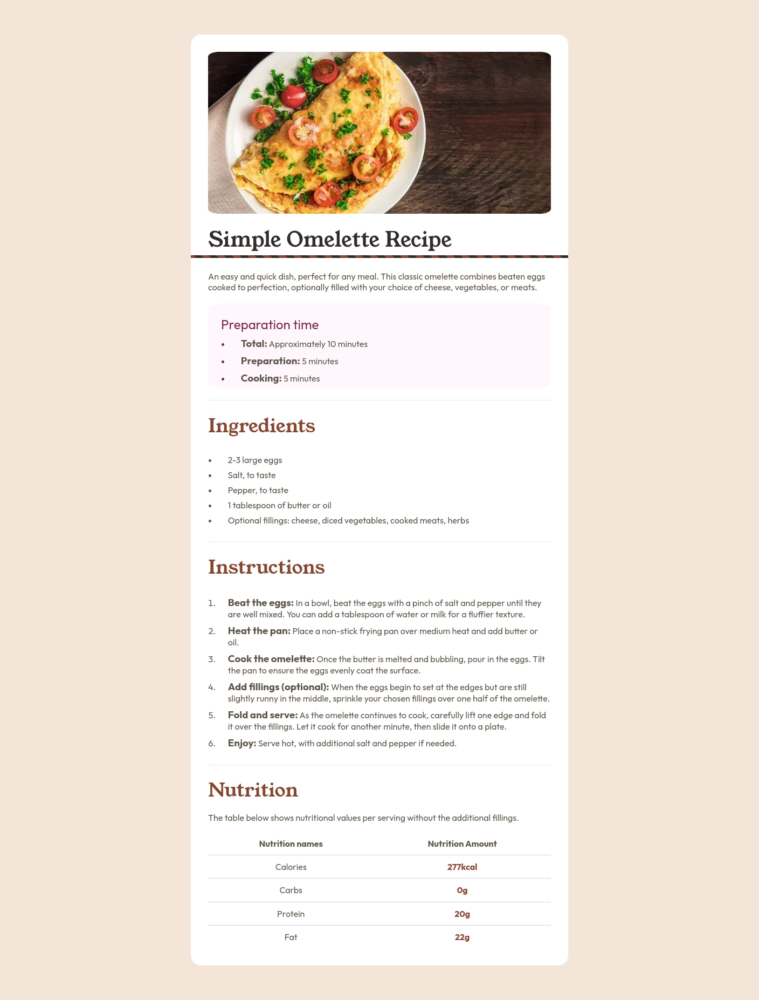
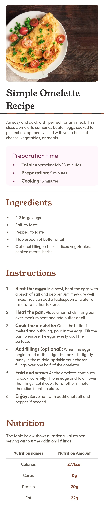

# Frontend Mentor - Custom Recipe Page solution

This is a custom solution to the [QR code component challenge on Frontend Mentor](https://www.frontendmentor.io/challenges/recipe-page-KiTsR8QQKm). Frontend Mentor challenges are helpful for beginners, intermediate or even advanced FE devs to learn more about frontend technologies and gain experience. This is my custom solution to one of fem challenges. I have added some more functionalites and designs to make look better. If you find my project cool then you can drop a rating or suggest improvements on fem site.

## Table of contents

- [Overview](#overview)
  - [Screenshot](#screenshot)
  - [Links](#links)
- [My process](#my-process)
  - [Built with](#built-with)
  - [What I learned](#what-i-learned)
- [Continued development](#continued-development)
- [Author](#author)

## Overview

### Screenshot

  - Desktop

  - Mobile

### Links

- Github URL: [Recipe Page](https://github.com/Tasin269/frontendmentor/tree/master/recipe-page-main)
- Live Site URL: [Recipe Page](https://tasin269.github.io/frontendmentor/recipe-page-main/)

## My process

### Built with

- Semantic HTML5 markup
- CSS custom properties
- Flexbox
- CSS Grid
- Mobile-first workflow
- SCSS - Css preprocessor

### What I learned

- More new ways on using semantic tags like where and when to use section tags, sub-headers after headers in each section, etc.
- Better management of font sizes in different breakpoints using css variables
- better css resets
- Some list-styling hacks: 
  - To get more space between marker and text content, we need to wrap all content of li element inside a div then set margin-inline-start property on that div to adjust the space.
  - To get the markers of ul/ol element inside container use margin-inline-start on that ul/ol element
- Cool techniques of border-image property like setting a overflowed bottom border. Border image can do many more tricks like setting overlay for background image. It's hard to understand tho.

### Continued development

I still need to learn more about css fundamentals and animation stuff.

## Author

- [All my fem challenges sites](https://tasin269.github.io/frontendmentor/)
- Frontend Mentor - [@Tasin269](https://www.frontendmentor.io/profile/Tasin269)
