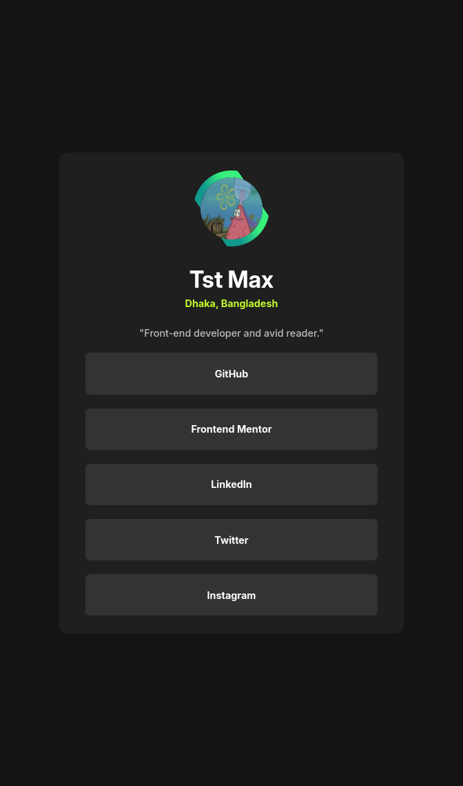
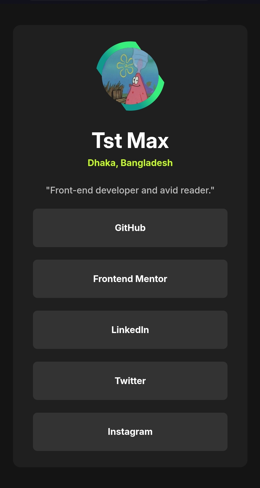

# Frontend Mentor - Custom Social Links Profile solution

This is a custom solution to the [Social Links Profile challenge on Frontend Mentor](https://www.frontendmentor.io/challenges/social-links-profile-UG32l9m6dQ). Frontend Mentor challenges are helpful for beginners, intermediate or even advanced FE devs to learn more about frontend technologies and gain experience. This is my custom solution to one of fem challenges. I have added some more functionalites and designs to make look better. If you find my project cool then you can drop a rating or suggest improvements on fem site.

## Table of contents

- [Overview](#overview)
  - [Screenshot](#screenshot)
  - [Links](#links)
- [My process](#my-process)
  - [Built with](#built-with)
  - [What I learned](#what-i-learned)
- [Continued development](#continued-development)
- [Author](#author)

## Overview

### Screenshot

  - Desktop



  - Mobile



### Links

- Github URL: [Social Links profile](https://github.com/Tasin269/frontendmentor/tree/master/social-links-profile-main)
- Live Site URL: [Social Links profile](https://tasin269.github.io/frontendmentor/social-links-profile-main/index.html)

## My process

### Built with

- Semantic HTML5 markup
- CSS custom properties
- Flexbox
- CSS Grid
- Mobile-first workflow
- SCSS - Css preprocessor
- Jquery - Js library

### What I learned

- A new css property **transform-style: preserve 3d** which preserves the 3d space when using rotateY or rotateX so we can make card flipping amimations.
- A new way to use linear gradient. We can use multiple linear-gradient function in a single property along with box sizing property values to make gradient borders. Then by customizing the size of border width we can make a nic gradient border.
```css
background: linear-gradient(#151515, #151515) padding-box,
      linear-gradient(
        var(--deg),
        transparent 0% 26%, 
        #11998e 0% 40%,
        #38ef7d 60% 75%,
        transparent 0% 100%
    ) border-box;

border: 10px solid transparent;
```
- We can use css custom properties to animate properties which are not animatable eg. linear gradient rotation.
```css
background: linear-gradient(#151515, #151515) padding-box,
      linear-gradient(
        var(--deg),
        transparent 0% 26%, 
        #11998e 0% 40%,
        #38ef7d 60% 75%,
        transparent 0% 100%
    ) border-box;

@property --deg {
  syntax: "<angle>";
  initial-value: 0deg;
  inherits: false;
}

@keyframes spinner {
  0% {
    --deg: 0deg;
  }
  100% {
    --deg: 180deg;
  }
}
```

### Continued development

I still need to learn more about css fundamentals and animation stuff.

## Author

- [All my fem challenges sites](https://tasin269.github.io/frontendmentor/)
- Frontend Mentor - [@Tasin269](https://www.frontendmentor.io/profile/Tasin269)
